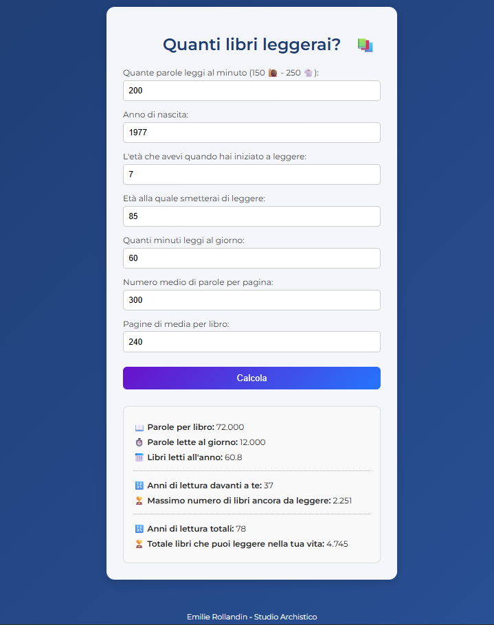

# 📘 Quanti Libri Leggerai

**Quanti Libri Leggerai** è una semplice web app che ti aiuta a stimare quanti libri potresti leggere nella tua vita, in base alle tue abitudini di lettura e ai tuoi obiettivi personali.

🔗 [Vai alla demo online](https://archistico.github.io/QuantiLibriLeggerai/)

---

### ✨ Caratteristiche

- Interfaccia pulita e responsive
- Calcolo personalizzato basato su:
  - Parole per pagina
  - Pagine per libro
  - Velocità di lettura (parole al minuto)
  - Età di inizio e fine lettura
  - Minuti di lettura al giorno
- Risultati chiari con icone e formattazione leggibile
- Design moderno con sfondo sfumato e font elegante

---

### 🚀 Come usarla

1. Visita la [pagina del progetto](https://archistico.github.io/QuantiLibriLeggerai/)
2. Inserisci i tuoi dati nei campi richiesti
3. Clicca su **Calcola**
4. Scopri quanti libri potresti leggere nella tua vita!

---

### 🧑‍💼 Autore

**Emilie Rollandin** – Studio Archistico

---

### 📄 Licenza

Questo progetto è distribuito sotto licenza MIT. Vedi il file [LICENSE](LICENSE) per maggiori dettagli.

---

Se desideri ulteriori personalizzazioni o hai bisogno di assistenza, non esitare a chiedere! 
